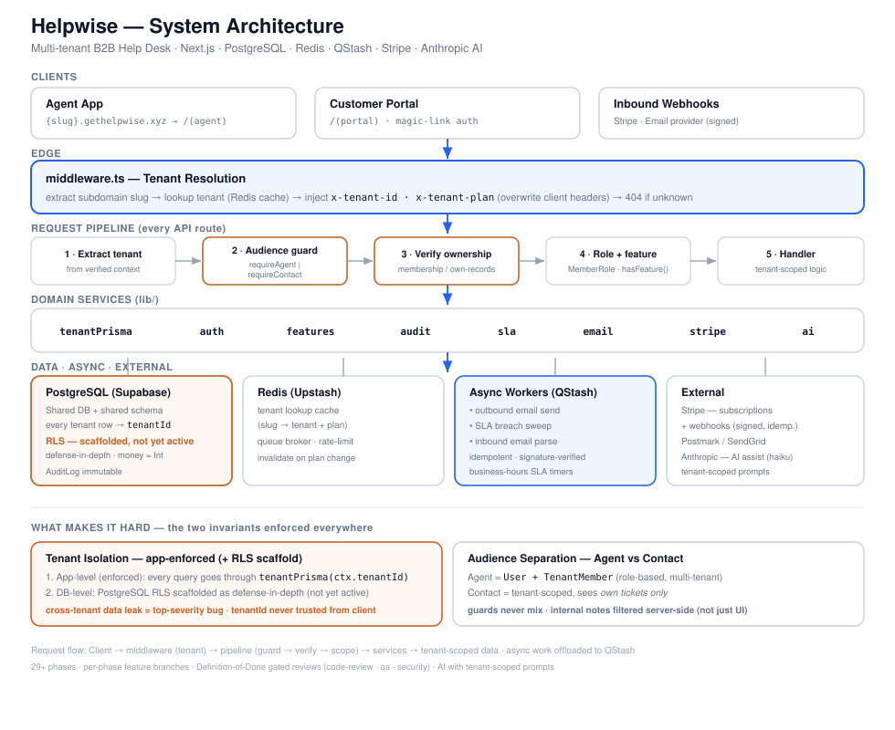

# Helpwise

**A multi-tenant B2B help desk / ticketing SaaS.** Each customer company (tenant) gets an
internal **agent workspace** and a public **customer portal**, served from its own subdomain
and fully isolated from every other tenant.

## 🚀 Live Demo

**Live on Vercel → [gethelpwise.xyz](https://gethelpwise.xyz)** (custom domain + wildcard SSL)

Two demo workspaces show real multi-tenant isolation — each sees a completely separate set of
tickets, contacts, and data:

- **Acme** → [acme.gethelpwise.xyz](https://acme.gethelpwise.xyz)
- **Globex** → [globex.gethelpwise.xyz](https://globex.gethelpwise.xyz)

**No signup required.** From the landing page click **"Try live demo"**, or inside a workspace
click **"Log in as demo agent"**. Open any ticket and try **AI summarize**, then switch between
Acme and Globex to confirm the two tenants never see each other's data — that's the isolation
working end to end.

> The root domain is `gethelpwise.xyz` (configured via `NEXT_PUBLIC_ROOT_DOMAIN`). Any reference
> to `helpwise.com` in the codebase is placeholder-only.

## Engineering Highlights

- **Multi-tenant isolation (application-enforced).** Every tenant-owned query runs through a
  `tenantPrisma(tenantId)` client (`src/lib/tenant.ts`) — a Prisma extension that auto-injects
  `tenantId` into the `where`/`data` of every operation, strips `tenantId` from update payloads,
  and hard-blocks raw SQL. Isolation lives at the application layer today; Postgres Row-Level
  Security is **scaffolded but not active** (see [Tenant Isolation](#tenant-isolation)).
- **Two separate audiences.** An internal agent workspace and a public customer portal use
  distinct JWT guards — `requireAgent()` and `requireContact()` (`src/lib/auth.ts`) — on separate
  cookies. A token minted for one audience is rejected by the other's guard, and portal queries
  filter `visibility = PUBLIC` so agent **internal notes can never leak** to customers.
- **Concurrency-safe ticket numbering.** `ticketNumber` is unique per tenant and generated by an
  **atomic counter** — `Tenant.ticketCounter { increment: 1 }` inside the same transaction as
  `ticket.create` (`src/lib/tickets.ts`) — so parallel inbound emails and API calls never collide
  or reuse a number (no read-then-write race).
- **Serverless async jobs.** Outbound email, SLA-breach sweeps, and inbound-email processing run
  through **Upstash QStash** (an HTTP-based queue that fits serverless), with worker routes that
  verify the QStash signature before doing any work.
- **AI assist, built safely.** Claude Haiku powers summarize / suggest-reply / suggest-tags.
  `src/lib/ai.ts` **never queries the database itself** — the caller passes in messages already
  fetched through `tenantPrisma`, so a prompt-injection payload has no path to cross-tenant data.
  Calls run with **no tools** (plain `messages.create`) and the system prompt treats ticket
  content strictly as data, not instructions.
- **Idempotent, signature-verified webhooks.** The Stripe webhook verifies the signature via
  `constructEvent`, then claims each event id against a unique `ProcessedStripeEvent` row before
  processing. The inbound-email webhook verifies a shared secret, then dedupes on a unique
  `(tenantId, messageId)` guard (`ProcessedInboundEmail`) — so provider retries never create
  duplicate tickets or double-charge state.
- **A production watcher that reports its own limits.** A scheduled GitHub Actions job probes
  `/api/health/readiness` and alerts only on verdict *transitions*. It spent 4.5 days reporting
  `FAIL` on a healthy site: the staleness threshold was derived from the cron interval declared in
  the workflow file, but measuring 89 real runs showed GitHub was firing roughly hourly, not every
  15 minutes — so the watcher kept judging itself late and calling that an outage. The fix was to
  declare the interval that was actually measured and to split "the watcher is late"
  (`WATCHER_LATE`, HTTP 200) from "the system is down" (`FAIL`, HTTP 503), because those are
  different facts and had been sharing one word. **This is not finished:** why GitHub throttles
  this repo is still unknown, the threshold stays pinned to a value GitHub can change without
  notice, and 3 of 21 closing-evidence rows are documented as deliberately unclosed.

## Architecture

Requests are routed by subdomain and gain their tenant identity **before** any handler runs:

```
{slug}.gethelpwise.xyz
        │
        ▼
  src/proxy.ts  ── extracts {slug} from the Host header (Node.js runtime, not Edge —
        │           so it can use ioredis + Prisma directly)
        │
        ├─ validate slug (/^[a-z0-9-]+$/), skip reserved subdomains & tenant-less paths
        │
        ├─ lookup tenant: Redis cache → DB on miss → cache result
        │
        └─ inject x-tenant-id + x-tenant-plan headers
                   (ALWAYS overwrites any client-supplied values — anti-spoofing)
                   │
                   ▼
        getTenantContext()  ── reads the verified headers (src/lib/tenant.ts)
                   │
                   ▼
        tenantPrisma(tenantId)  ── auto-scopes every query by tenantId
                   │
                   ▼
              PostgreSQL (Supabase)
```

Because the proxy strips and rewrites `x-tenant-id` / `x-tenant-plan` on every request, handlers
can trust the tenant context and **never accept `tenantId` from the client**.



### Tenant Isolation

Isolation today is **application-enforced**: `tenantPrisma()` guarantees every tenant-owned query
carries a `tenantId` filter, and route handlers read that id only from the proxy-injected header.

Postgres **Row-Level Security is scaffolded as a future defense-in-depth layer but is not
currently enforcing.** The application connects through a `BYPASSRLS` database role, and the RLS
code path is gated behind an `RLS_ENABLED` kill-switch that **defaults to off**. Activating RLS
requires switching to a non-bypass role, applying the FORCE-RLS migration, and enabling the flag
together. Until then, the security boundary is the application layer — not the database.

## Tech Stack

Versions match [`package.json`](package.json):

| Area | Choice |
| --- | --- |
| Framework | Next.js 16.2 (App Router) + React 19.2 + TypeScript 5 |
| Database | Prisma 7.8 + PostgreSQL (Supabase), via `@prisma/adapter-pg` |
| Styling | Tailwind CSS v4 |
| UI / Icons | Custom components + Lucide React |
| Charts | Recharts 3.8 (reporting dashboard) |
| Forms & Validation | React Hook Form 7 + Zod 4 |
| Auth | `jose` (JWT in httpOnly cookies) + `bcryptjs` |
| Cache & Queue | Upstash — Redis (`ioredis`) + QStash |
| Billing | Stripe 22 (Subscriptions + Webhooks) |
| Email | Postmark/SendGrid (outbound + inbound parse webhook) |
| AI | Claude Haiku via `@anthropic-ai/sdk` |
| Testing | Vitest 4 |
| Hosting | Vercel (custom domain + wildcard SSL) |

## Run Locally

### Prerequisites

- Node.js 20+ (see `engines` in `package.json`)
- A PostgreSQL database — Supabase recommended (provides both pooled `DATABASE_URL` and direct
  `DIRECT_URL` connection strings)
- A Redis instance (Upstash recommended)
- Optional for the full feature set: Stripe, Upstash QStash, an email provider, and an Anthropic
  API key

### Setup

1. Install dependencies (`postinstall` runs `prisma generate` automatically):

   ```bash
   npm install
   ```

2. Create a `.env` file. [`.env.example`](.env.example) documents every variable; the core ones:

   | Variable | Purpose |
   | --- | --- |
   | `DATABASE_URL` / `DIRECT_URL` | Postgres pooled + direct connections (Prisma 7) |
   | `NEXT_PUBLIC_ROOT_DOMAIN` | Root domain for subdomain routing (`gethelpwise.xyz`) |
   | `AUTH_SECRET` | JWT signing secret (min. 32 chars) |
   | `REDIS_URL` | Redis for tenant-lookup cache + rate limiting |
   | `RLS_ENABLED` | RLS kill-switch (leave `false` — see Tenant Isolation) |
   | `STRIPE_SECRET_KEY` / `STRIPE_WEBHOOK_SECRET` | Billing + webhook verification |
   | `QSTASH_TOKEN` / `QSTASH_CURRENT_SIGNING_KEY` / `QSTASH_NEXT_SIGNING_KEY` | Async queue |
   | `EMAIL_PROVIDER` / `EMAIL_PROVIDER_API_KEY` / `EMAIL_INBOUND_WEBHOOK_SECRET` | Email in/out |
   | `SUPABASE_URL` / `SUPABASE_SERVICE_ROLE_KEY` / `SUPABASE_STORAGE_BUCKET` | File attachments |
   | `ANTHROPIC_API_KEY` | AI assist |

   See [`docs/operations.md`](docs/operations.md) for how to generate `AUTH_SECRET` and where to
   obtain each credential.

3. Apply migrations, generate the Prisma client, and seed reference data (plans, feature flags):

   ```bash
   npm run db:deploy      # prisma migrate deploy
   npm run db:generate    # prisma generate
   npx prisma db seed     # seed plans + feature flags
   ```

4. Start the dev server:

   ```bash
   npm run dev
   ```

   Open [http://localhost:3000](http://localhost:3000). Tenant pages are served from subdomains
   (`{slug}.localhost:3000` in development, `{slug}.gethelpwise.xyz` in production) — resolved by
   `src/proxy.ts`.

### npm Scripts

Every script below exists in [`package.json`](package.json):

| Script | Description |
| --- | --- |
| `npm run dev` | Start the development server |
| `npm run build` | Build for production |
| `npm run start` | Start the production server |
| `npm run lint` | Run ESLint |
| `npm run test` | Run the Vitest suite once |
| `npm run test:watch` | Run tests in watch mode |
| `npm run db:generate` | Generate the Prisma client |
| `npm run db:migrate` | Create/apply migrations in development (`prisma migrate dev`, needs a TTY) |
| `npm run db:deploy` | Apply migrations non-interactively (`prisma migrate deploy`) |
| `npm run db:studio` | Open Prisma Studio |
| `npm run smoke:stripe` | Run the Stripe billing smoke test (`scripts/stripe-smoke.ts`) |

## Project Structure

```
src/
  app/
    (agent)/      Internal agent workspace — requires agent login + tenant membership
    (portal)/     Public customer portal — contacts see only their own tickets
    (marketing)/  Landing, pricing (no tenant context)
    api/          API routes — every route enforces tenant context + audience guard
    api/v1/       Public REST API (API-key auth) — see docs/api.md
    api/webhooks/ Stripe + inbound-email webhooks (signature-verified, idempotent)
    api/jobs/     QStash worker routes (SLA sweep, outbound email) — verify QStash signature
  lib/
    tenant.ts     getTenantContext() + tenantPrisma() — the isolation core
    prisma.ts     Base Prisma client (adapter-pg)
    auth.ts       requireAgent() / requireContact() audience guards
    api-auth.ts   requireApiKey() guard for the public API
    tickets.ts    Ticket creation + atomic ticketNumber counter
    features.ts   hasFeature() — plan + per-tenant feature flags
    audit.ts      audit.log() — immutable audit trail
    email.ts      Outbound send + threading;  email/  inbound parsing
    sla.ts        SLA deadline calculation (business-hours aware)
    ai.ts         Claude Haiku assist — never queries the DB itself
    queue.ts      Upstash QStash enqueue helpers
    redis.ts      Redis client + tenant-cache keys
    rate-limit.ts Redis-backed rate limiting
    slug.ts       Canonical slug validation / normalization
  proxy.ts        Tenant resolution from subdomain (Node.js runtime)
prisma/
  schema.prisma   Database schema (shared DB + shared schema, tenantId column)
  migrations/     Migration history
  seed.ts         Seed script (plans, feature flags)
```

## Documentation

- [`docs/api.md`](docs/api.md) — Public REST API reference (auth, endpoints, rate limits, errors)
- [`docs/operations.md`](docs/operations.md) — Operations runbook (env vars, migrations, webhook
  setup, SLA sweep cron)
- [`docs/deploy-checklist.md`](docs/deploy-checklist.md) — Pre-deploy verification checklist
- [`docs/stripe-smoke.md`](docs/stripe-smoke.md) — Stripe billing smoke-test guide
- [`CLAUDE.md`](CLAUDE.md) — Architecture, multi-tenancy rules, and conventions for contributors
- [`.claude/specs/incident-2026-08-10-prod-503.md`](.claude/specs/incident-2026-08-10-prod-503.md)
  — Incident write-up: the readiness watcher reporting `FAIL` for 4.5 days on a healthy site,
  including the three times the evidence was withdrawn and what was predicted before measuring
- [`.claude/evidence/phase-39-h17-2026-08-14/`](.claude/evidence/phase-39-h17-2026-08-14/)
  — Raw GitHub Actions run data plus `analyze.mjs`. Every number quoted in that write-up is
  reproducible by running the script against the JSON in this folder; the script is the definition
  of each statistic, so nothing rests on remembering how a figure was computed
